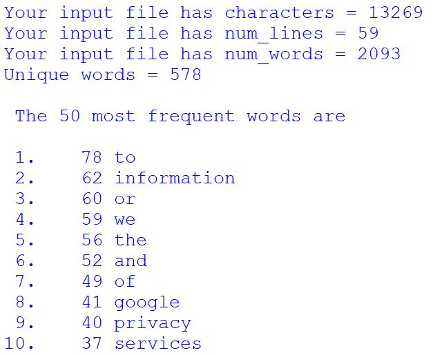

<!-- PROJECT LOGO -->

    
  </a>

  <h3 align="center">Google - Word Count</h3>

  

    Find the most frequently used words!
     
    <a href="https://github.com/Mathurkarishma/google-word-count"><strong>Explore the docs »</strong></a>
     
     
    <a href="https://github.com/Mathurkarishma/google-word-count/issues">Report Bug</a>
    ·
    <a href="https://github.com/Mathurkarishma/google-word-count/issues">Request Feature</a>
  

<!-- TABLE OF CONTENTS -->

  
<h2 style="display: inline-block">Table of Contents</h2>

  <ol>
    <li>
      <a href="#about-the-project">About The Project</a>
      <ul>
        <li><a href="#built-with">Built With</a></li>
      </ul>
    </li>
    <li>
      <a href="#getting-started">Getting Started</a>
    </li>
    <li><a href="#usage">Usage</a></li>
    <li><a href="#contact">Contact</a></li>
    <li><a href="#acknowledgements">Acknowledgements</a></li>
  </ol>

<!-- ABOUT THE PROJECT -->
## About The Project

Need to figure out if you're being too repetitive?  Curious if you overuse words?  Or did your boss just ask you for the most frequently used terms in a wordy file?  Let's find out how to get a word count of the top 50 words in a few files.  This code we are using has been modified from Tony Donaldson.

### Built With

* [Python 3](https://www.python.org/downloads/)
* [IDLE](https://docs.python.org/3/library/idle.html) (comes with Python)

<!-- GETTING STARTED -->
## Getting Started

To get a local copy up and running, download the `google-frequency.py` and the text input files, `Google_June1999.txt`, `Google_Mar2009.txt`, and `Google_Oct2019.txt` into the same folder. Then run the code in an IDE software, such as IDLE, or in Command Prompt.

<!-- USAGE EXAMPLES -->
## Usage

Using the `Google_Mar2009.txt` file in IDLE will output:

Modify the code to use another .txt file in the below line.

Mar2009 File:  `s = open('Google_Mar2009.txt', encoding="utf8").read()`  
June1999 File:  `s = open('Google_June1999.txt', encoding="utf8").read()`

Using the `Google_Oct2019.txt` file in Command Prompt:

`>>python3 google-frequency.py`  
`>>`

<!-- CONTACT -->
## Contact

Karishma Mathur - karishma324@gmail.com

Project Link: [https://github.com/Mathurkarishma/google-word-count](https://github.com/Mathurkarishma/google-word-count)

<!-- ACKNOWLEDGEMENTS -->
## Acknowledgements

* Dr. Prasanna Menta at [University of Maryland, Global Campus](https://www.umgc.edu/) - Fall 2019  
* [Toby Donaldson's Python: Visual QuickStart Guide](https://www.amazon.com/Python-Visual-QuickStart-Guide-3rd/dp/0321929551)

<!-- MARKDOWN LINKS & IMAGES -->
<!-- https://www.markdownguide.org/basic-syntax/#reference-style-links -->
[contributors-shield]: https://img.shields.io/github/contributors/github_username/repo.svg?style=for-the-badge
[contributors-url]: https://github.com/github_username/repo/graphs/contributors
[forks-shield]: https://img.shields.io/github/forks/github_username/repo.svg?style=for-the-badge
[forks-url]: https://github.com/github_username/repo/network/members
[stars-shield]: https://img.shields.io/github/stars/github_username/repo.svg?style=for-the-badge
[stars-url]: https://github.com/github_username/repo/stargazers
[issues-shield]: https://img.shields.io/github/issues/github_username/repo.svg?style=for-the-badge
[issues-url]: https://github.com/github_username/repo/issues
[license-shield]: https://img.shields.io/github/license/github_username/repo.svg?style=for-the-badge
[license-url]: https://github.com/github_username/repo/blob/master/LICENSE.txt
[linkedin-shield]: https://img.shields.io/badge/-LinkedIn-black.svg?style=for-the-badge&logo=linkedin&colorB=555
[linkedin-url]: https://linkedin.com/in/github_username
